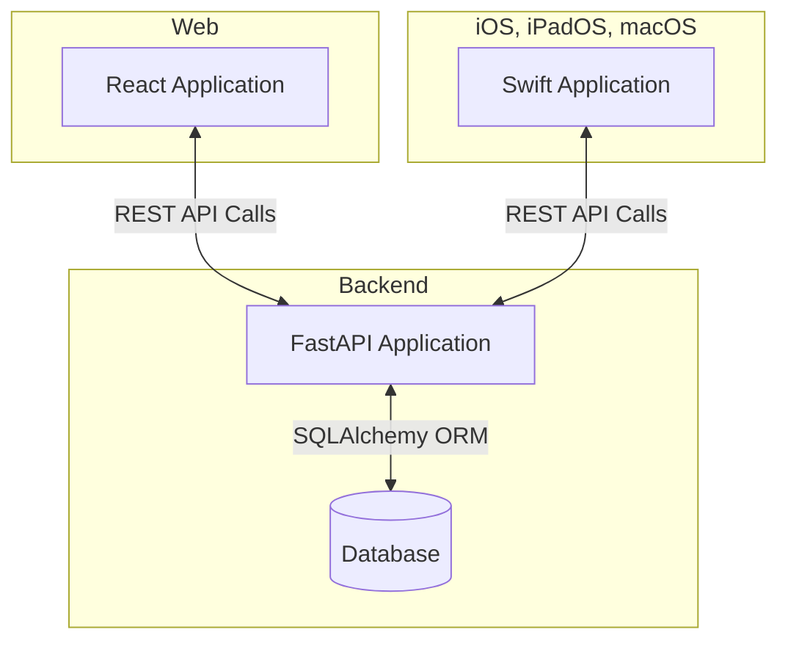

# 🧑‍💻 Developer Introduction

## System Architecture

Nexus includes a core set of projects:
 - FastAPI with SQLAlchemy for RESTful API and database interfacing
 - React for frontend web
 - Swift for Apple platforms.

 

## Root Folders

| Folder | Description                                                                 |
|------------------|-----------------------------------------------------------------------------|
| `.github`       | GitHub-specific configurations and workflows for CI/CD.                    |
| `.venv`         | Virtual environment for Python dependencies.                               |
| `.vscode`       | VS Code-specific settings and configurations.                              |
| `alembic`       | Database migration scripts and configurations.                             |
| `docs`          | Documentation for developers, deployment, and user guides.                 |
| `darwin`  | Swift-based application for Apple platforms.                               |
| `fastapi` | Backend API built with FastAPI and SQLAlchemy.                             |
| `react`   | React-based frontend web application.                                      |
| `tests`         | Test cases for various components of the project.                          |

## Root Files

| File Path             | Description                                                                 |
|-----------------------|-----------------------------------------------------------------------------|
| `.flake8`            | Configuration file for the flake8 linter.                                  |
| `.gitattributes`     | Git configuration file for defining attributes of files in the repository. |
| `.gitignore`         | Specifies files and directories to be ignored by Git.                     |
| `alembic.ini`         | Configuration file for Alembic database migrations.                       |
| `CHANGELOG.md`        | A log of changes made to the project over time.                            |
| `justfile`            | Commonly used commands for development and project management.             |
| `LICENSE`             | The license under which the project is distributed.                        |
| `mkdocs.yml`          | Configuration file for MkDocs documentation site.                         |
| `package-lock.json`   | Automatically generated file for locking Node.js dependencies.             |
| `package.json`        | Node.js dependencies and scripts for the React frontend.                   |
| `pyproject.toml`      | Python project configuration and metadata.                                 |
| `README.md`           | The main README file for the project.                                      |
| `requirements-dev.txt`| Python dependencies for development purposes.                              |
| `requirements.txt`    | Python dependencies for the project.                                       |
| `yarn.lock`           | Dependency lock file for Yarn package manager.                             |

Folder structure and conventions
How to run locally (e.g., Docker, npm install, uvicorn main:app)
How React talks to FastAPI (e.g., API base URLs, auth)
Testing setup (React Testing Library, pytest, etc.)
Code style, linting, and pre-commit hooks
Useful scripts/aliases

Setting Up the Development Environment: Instructions for cloning the repo, installing dependencies, and running the project locally.
Codebase Overview: Explain the structure of the codebase (e.g., nexus-react, nexus-fastapi, nexus-docs).
API Documentation: Include details about REST/GraphQL APIs.
Contributing Guidelines: Explain how to contribute to the project.

## Models Documentation
For detailed information about the models used in the project, refer to the [Models Documentation](models/README.md).

## Sample Data

Sample data is stored in the `data` folder. If you need to store sample data that should not be tracked by Git, use the `data.local` folder, which is included in `.gitignore`.

## Contributing
- Follow the project's coding standards and guidelines.
- Submit pull requests for any changes or new features.
